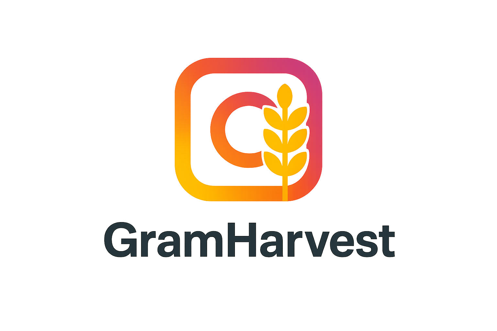
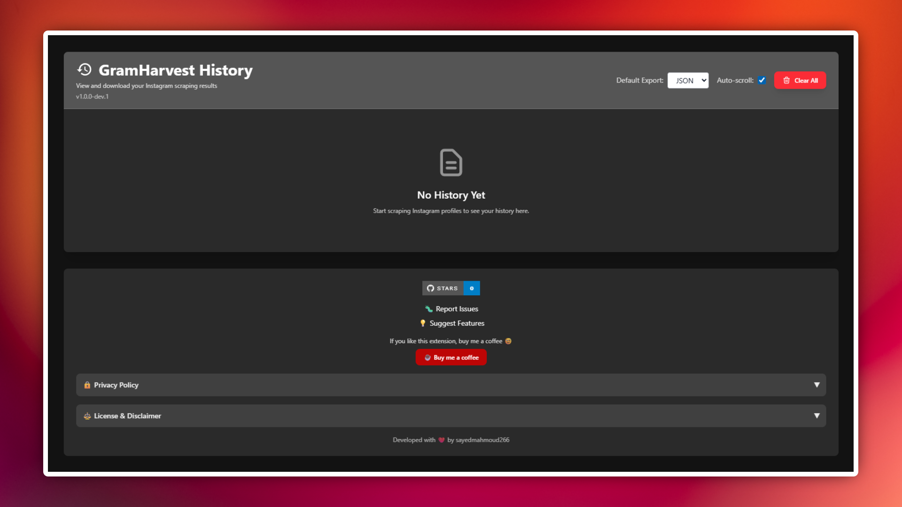
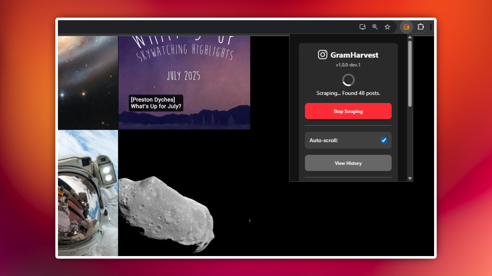
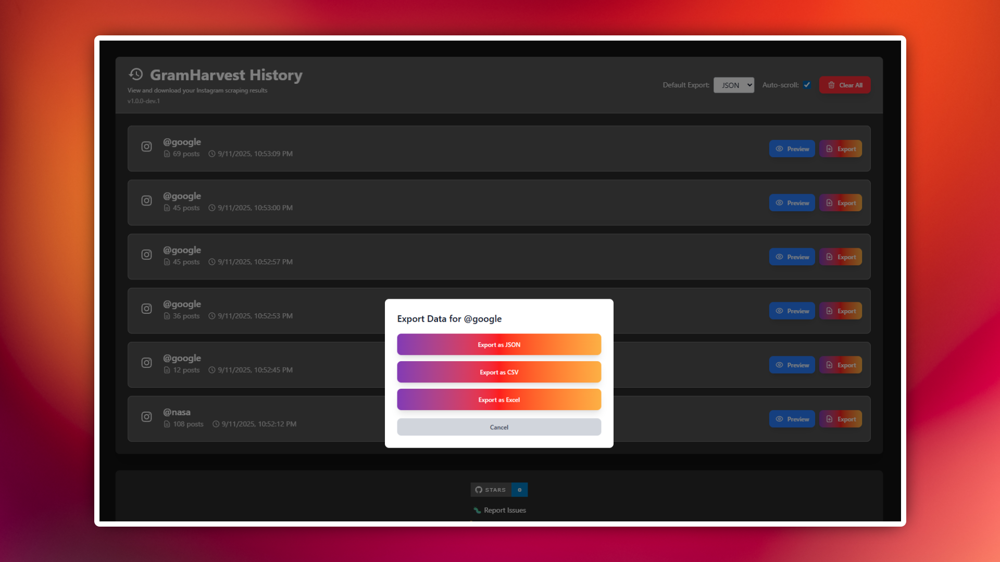

<div align="center">
  
  
  # GramHarvest - Instagram Data Collection Extension
  
  [](https://github.com/sayedmahmoud266/gramharvest)
  [](https://reactjs.org/)
  [](https://www.typescriptlang.org/)
  [](https://vitejs.dev/)
  [](https://tailwindcss.com/)
  [](https://developer.chrome.com/docs/extensions/)
  [](https://yarnpkg.com/)
</div>

A powerful Chrome extension built with React + TypeScript + TailwindCSS for comprehensive Instagram data collection. Extract detailed post information including metadata, engagement metrics, and media links from Instagram profiles with advanced scraping modes and export capabilities.

## 🎬 Demo

<div align="center">
  
</div>

## 📸 Screenshots

<div align="center">
  
  
  
</div>

## Tech Stack

- **React 18** with TypeScript for UI components
- **Vite** for fast development and building
- **TailwindCSS v4** for modern, responsive styling
- **Gulp** for Chrome extension packaging and bundling
- **Chrome Extension Manifest v3** for modern extension architecture
- **Yarn** for dependency management

## Features

### Core Functionality
- **Enhanced Data Collection:** Extract comprehensive post data including:
  - Post URLs (posts and reels)
  - Author information and usernames
  - Post captions with multi-line support
  - Thumbnail image URLs
  - Like counts with smart number parsing (K, M, B format)
  - Comment counts
  - Creation dates and timestamps
  - View counts (for videos/reels)
  - Post types (post/reel/story)
  - Page type detection (main profile/reels tab)

### User Experience
- **One-Click Scraping:** Navigate to any Instagram profile and start scraping with a single click
- **Background Operation:** Scraping runs in the background, allowing you to continue browsing
- **Dual Scraping Modes:**
  - **Auto-Scroll Mode:** Automatically scrolls to end of profile with continuous content loading
  - **Manual Scroll Mode:** Scrapes as you manually scroll with debounced scroll detection
- **Real-time Updates:** Live progress tracking with immediate status updates
- **Stop & Resume:** Full control over the scraping process
- **Smart End Detection:** Enhanced algorithms to detect when profile end is reached

### Export & History
- **Multiple Export Formats:** Download data as JSON, CSV, or modern Excel (.xlsx)
- **Default Format Selection:** Set preferred export format with persistent storage
- **Smart CSV Export:** Proper handling of multi-line captions and special characters
- **Modern XLSX Export:** Full Excel compatibility with structured worksheets
- **Comprehensive History:** View all past scraping jobs with detailed metadata
- **Data Preview:** Preview collected data with thumbnail images before downloading
- **Clear History:** Manage storage with one-click history clearing
- **Instant Results:** History updates immediately after scraping completes

### Interface & Information
- **Modern UI:** Beautiful Instagram-inspired gradient design with backdrop blur effects
- **Compact Design:** 360px max-height popup with scrollable content
- **Version Display:** Current extension version shown in UI
- **Responsive Design:** Optimized for various screen sizes
- **Smooth Animations:** Enhanced user experience with fluid transitions
- **Comprehensive Info Section:**
  - **Privacy Policy:** Transparent data handling and local storage explanation
  - **License Agreement:** Clear terms of use and responsibility disclaimers
  - **GitHub Integration:** Direct links to report issues and suggest features
  - **Developer Attribution:** Credit and contact information

## Development

### Prerequisites
- Node.js (v16 or higher)
- Yarn package manager

### Setup
1. **Clone the repository:**
   ```bash
   git clone <repository-url>
   cd gramharvest
   ```

2. **Install dependencies:**
   ```bash
   yarn install
   ```

3. **Build the extension:**
   ```bash
   yarn build && yarn build:extension
   ```

4. **For development with hot reload:**
   ```bash
   yarn dev
   ```

### Available Scripts
- `yarn build` - Build React components with Vite
- `yarn build:extension` - Package extension with Gulp
- `yarn dev` - Start development server
- `yarn lint` - Run TypeScript linting

## Installation

Since this extension is not on the Chrome Web Store, you need to load it manually in Developer Mode.

1. **Build the extension:** Run `yarn build && yarn build:extension` to create the `build` folder
2. **Open Chrome Extensions:** Navigate to `chrome://extensions` in Chrome
3. **Enable Developer Mode:** Toggle the **Developer mode** switch in the top-right corner
4. **Load Unpacked:** Click **"Load unpacked"** and select the `build` folder from this project
5. **Verify Installation:** The "GramHarvest" extension should appear in your extensions list

## How to Use

### Basic Scraping
1. **Login to Instagram:** Ensure you're logged into Instagram in your browser
2. **Navigate to Profile:** Go to any Instagram profile page (e.g., `https://www.instagram.com/instagram/`)
3. **Open Extension:** Click the GramHarvest icon in your browser toolbar
4. **Configure Settings:**
   - Toggle **Auto-scroll** on/off to choose scraping mode
   - **Auto-scroll ON:** Extension automatically scrolls to profile end
   - **Auto-scroll OFF:** Manually scroll while extension scrapes continuously
   - Set your preferred export format (JSON, CSV, Excel)
5. **Start Scraping:** Click **"Scrape Current Profile"** button
6. **Monitor Progress:** View real-time updates of collected posts count
7. **Stop if Needed:** Use **"Stop Scraping"** button to halt the process

### Managing Results
1. **View History:** Click **"View History"** to see all past scraping jobs
2. **Preview Data:** Use the **"Preview"** button to examine collected data
3. **Export Options:** Choose from multiple export formats:
   - **JSON:** Complete data with all metadata
   - **CSV:** Spreadsheet-compatible format
   - **Excel:** .xlsx format for Excel compatibility
4. **Clear History:** Use **"Clear History"** to manage storage space

### Advanced Features
- **Intelligent Scraping Modes:**
  - **Auto-scroll:** Continuous scrolling with content loading detection
  - **Manual scroll:** Debounced scroll event handling for user-controlled scraping
- **Background Operation:** Close popup while scraping continues
- **Real-time Updates:** See progress updates without refreshing
- **Comprehensive Data:** Extract author, captions, engagement metrics, thumbnails, and timestamps
- **Duplicate Prevention:** Smart filtering to avoid collecting duplicate posts
- **Multi-tab Support:** Handle different Instagram page types (main profile, reels tab)
- **Error Recovery:** Robust error handling with graceful degradation

## Privacy & Legal

### Privacy Policy
- **No Data Collection:** This extension does not collect any usage data or personal information
- **Local Storage Only:** All scraped data is stored locally in your browser
- **No Remote Servers:** No data is transmitted to external servers
- **Open Source:** Complete transparency - review the code yourself

### License & Disclaimer
- **MIT License:** Open source project - see [LICENSE](LICENSE) file for details
- **User Responsibility:** Users are solely responsible for data collection practices
- **Ethical Use:** Respect Instagram's terms of service and others' privacy
- **No Liability:** Developers are not responsible for misuse of this tool

## Support & Contributing

- 🐛 [Report Issues](https://github.com/sayedmahmoud266/gramharvest/issues/new?template=bug_report.md&title=[Bug]%20)
- 💡 [Suggest Features](https://github.com/sayedmahmoud266/gramharvest/issues/new?template=feature_request.md&title=[Feature]%20)
- ☕ [Buy Me a Coffee](https://www.buymeacoffee.com/sayedmahmoud266)

## Credits

Developed with ❤️ by [sayedmahmoud266](https://sayedmahmoud266.website)

This extension was coded with the help of Cascade, a powerful agentic AI coding assistant from Windsurf, powered by Google's Gemini Pro models & Anthropic's Claude models.
